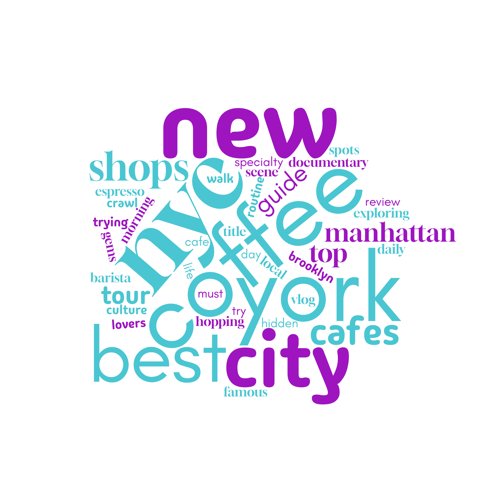

# GEOG 458 Lab 2 – Web Data Collection and Visualization

## Topic and Search Parameters
For this lab, I explored YouTube content related to coffee culture.
The search term *coffee* was used for two locations: Seattle, WA and New York, NY.
Video titles were collected manually from YouTube search results and saved as CSV files.

## Purpose of the Comparison
Seattle and New York are both major cities with strong coffee cultures, but they differ in pace, lifestyle, and media trends. This comparison was chosen to examine whether these differences appear in how coffee-related content is described on YouTube.

## Word Cloud Comparison

### Seattle, WA

### New York, NY

The Seattle word cloud emphasizes terms related to local cafes and specialty coffee, while the New York word cloud highlights lifestyle, vlogging, and city-based experiences. Some overlap exists, but the emphasis differs between locations.

## Possible Explanations
These patterns may reflect differences in local culture and how creators frame coffee-related content. Seattle is often associated with specialty and craft coffee, while New York content may focus more on daily routines and urban experiences.

## Unexpected Findings
Before conducting this exercise, I expected the word clouds to be very similar. However, the differences suggest that location influences how similar topics are presented online.

## Future Improvements
This research could be improved by including additional locations, multiple search terms, or other metadata such as upload date or video duration.

## Data Downloads
- [Seattle CSV](assets/search-result-seattle.csv)
- [New York CSV](assets/search-result-newyork.csv)
